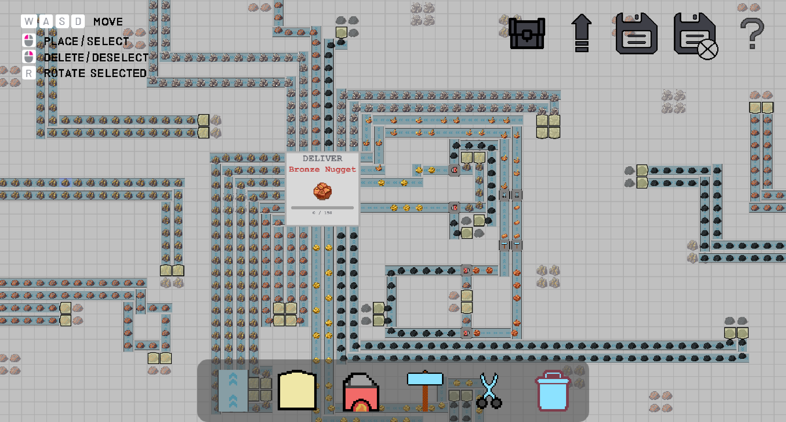
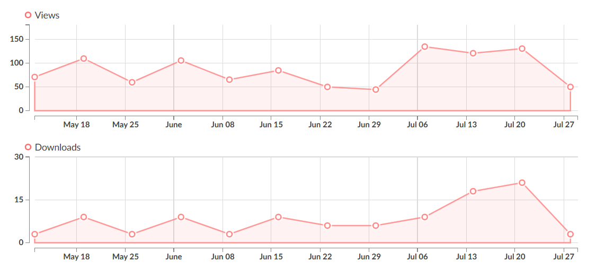

# Industry

A top-down factory-building game focused on resource gathering, machine construction, and production line optimization.

## Overview

**Industry** challenges players to build the most efficient factory possible, starting with just three basic resources and a handful of machines. Scale up your operations, unlock new automation tiers, and combine materials in increasingly complex ways.

To **download** and learn more about the game visit https://tomalmog.itch.io/industry

## Features

- **Resource Management**: Gather and process materials through interconnected production chains
- **Machine Building**: Construct and strategically place various types of manufacturing equipment
- **Upgrade System**: Enhance every building using unique resources to boost efficiency
- **Progressive Complexity**: Start simple and gradually unlock higher level machines
- **Optimization Focus**: Constantly reorganize and refine your factory layout for maximum productivity

## Analytics

The game has recieved over 400 downloads and is still being downloaded approximately 50 times per month

## Development

**Industry** was developed over the course of a semester as a high school computer science capstone project. The development process focused on implementing complex game systems while maintaining clean, modular code architecture.

### Technical Implementation

The game features several sophisticated systems built from scratch:

- **Dynamic Factory Simulation**: Realtime resource calculations across interconnected production chains
- **Modular Building System**: Flexible architecture allowing for easy expansion of machine types and behaviors  
- **Intelligent UI Framework**: Custom inventory and upgrade interfaces with sorting and searching functionality
- **Performance Optimization**: Efficient rendering and update loops to handle large-scale factory operations
- **Save System**: Comprehensive serialization of factory states and player progress

### Built With

- **Engine**: Godot 4
- **Language**: GDScript

The entire codebase demonstrates object oriented programming principles, efficient algorithms for resource management, and scalable game architecture suitable for continued expansion.

## Acknowledgments

- Heavily inspired by *Shapez.io* and other factory games such as *Factorio*
